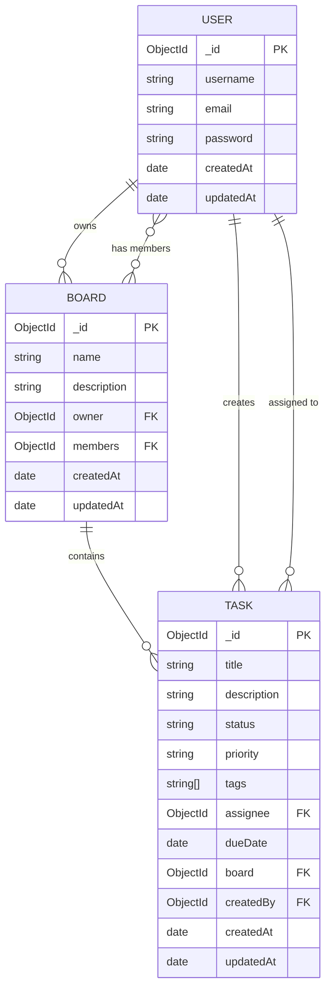

# CollabBoard

A collaborative Kanban-style task board — Session Workshop Project.

## Tech Stack

| Layer | Technology |
|-------|-----------|
| Frontend | React 18, Vite, React Router v7, @hello-pangea/dnd |
| Backend | Node.js, Express 4 |
| Database | MongoDB, Mongoose 8 |
| Auth | JWT (jsonwebtoken), bcryptjs |
| Client Persistence | localStorage (task cache + offline write queue) |
| Testing | Vitest + React Testing Library (client), Jest + Supertest (server) |

## Setup Instructions

### Prerequisites
- Node.js ≥ 18
- MongoDB running locally on `localhost:27017`

### 1 — Clone and install

```bash
# Server
cd server
npm install

# Client
cd ../client
npm install
```

### 2 — Configure environment

```bash
cd server
cp .env.example .env
# Edit .env if needed (defaults work for local MongoDB)
```

### 3 — Start dev servers

```bash
# Terminal 1 — Backend (port 5000)
cd server && npm run dev

# Terminal 2 — Frontend (port 3000)
cd client && npm run dev
```

Open **http://localhost:3000** in your browser.

## Database Schema



### Embedding vs. Referencing Decisions

| Relationship | Strategy | Reason |
|---|---|---|
| `Task.board` | Reference (ObjectId) | Boards can have many tasks; avoids large embedded arrays |
| `Task.assignee` | Reference (ObjectId) | User data changes independently |
| `Board.members` | Array of References | Small teams; simple membership check |
| `Task.tags` | Embedded string array | Tags are simple values, no separate collection needed |

## Architecture

```
client/src/
  components/      — Reusable React components (Board, Column, TaskCard, …)
  services/
    api.js         — Fetch wrapper for all REST calls
    storage.js     — localStorage cache + offline write queue
  App.jsx          — Root: auth state, task CRUD, offline flush on mount

server/
  config/db.js     — Mongoose connection
  models/          — User, Board, Task schemas
  controllers/     — authController, taskController
  routes/          — authRoutes, taskRoutes
  middlewares/     — JWT protect middleware
  server.js        — Express app entry point
```

## Offline Support

When the backend is unreachable, the app:
1. Reads tasks from the **localStorage cache** (so the board is still visible).
2. Enqueues any create / update / delete operations in an **offline write queue** (also localStorage).
3. On the next page load while online, the queue is **automatically flushed** to the server before fetching fresh data.

## Known Limitations

- One board per user (auto-created on registration). Multi-board support is planned for a later milestone.
- Real-time sync (WebSockets) is planned for Milestone 5.
- Docker Compose setup is planned for Milestone 5.
